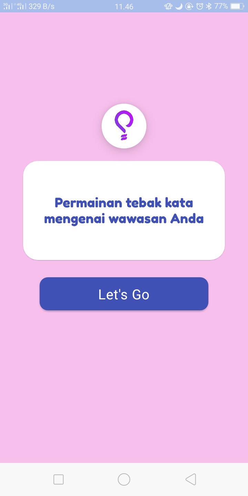
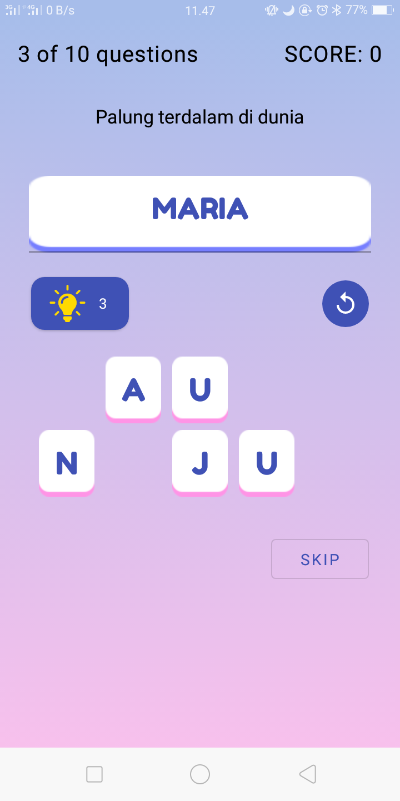
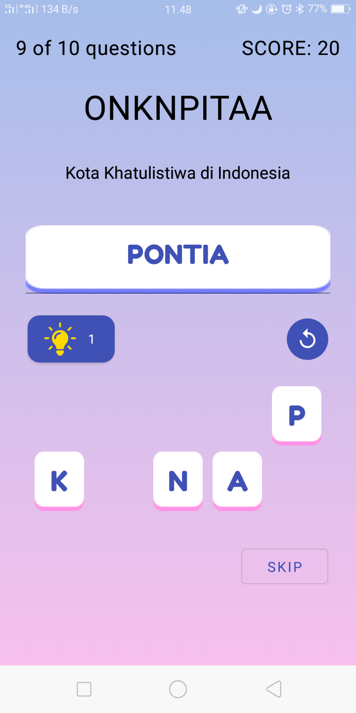
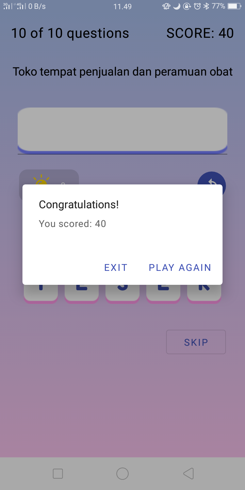

WordGuess App
===================================

Game word guess about your knowledge. This game is single player. To play the game, 
player has to guess a word using all the letters in the displayed screen with question.
This code demonstrates the Android Architecture component- ViewModel and LiveData.
This code sample also demonstrates how to implement Data Binding with LiveData.

Used in the [Android Basics with Kotlin-Unit 3](https://developer.android.com/courses/pathways/android-basics-kotlin-unit-3-pathway-3) course.

Getting Started
---------------

1. Download and run the [app](https://drive.google.com/file/d/1teM-LSRvzHXg7cmfvV2n93yxfOQuINO5/view?usp=sharing).
2. Guess a word from the question.
3. You can use hint or skip for next word.
4. Play again or exit.
5. Happy!

Screenshoot
---------------

Welcome Screen             |  Game Start
:-------------------------:|:-------------------------:
  |  

Hint Word             |  Play Again or Exit
:-------------------------:|:-------------------------:
  |  
